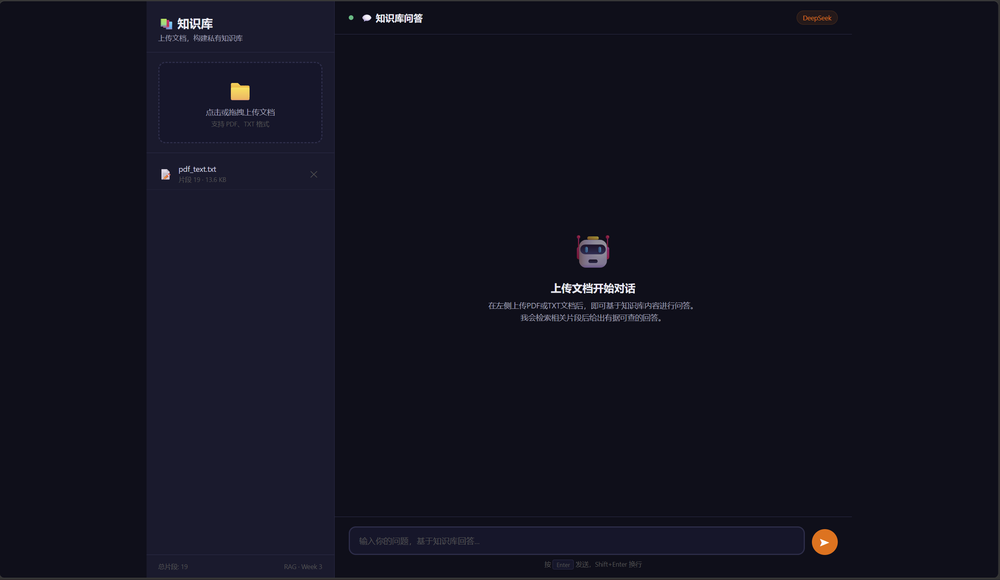
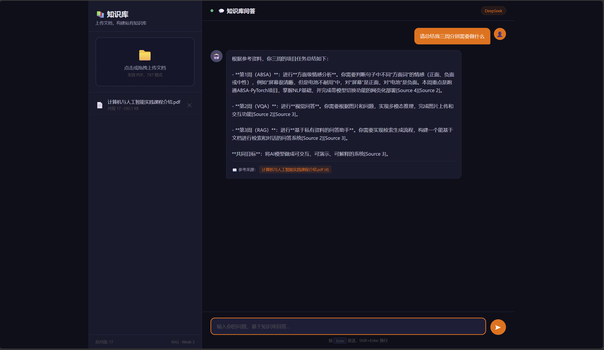

# RAG · 知识库问答 Web 系统

> 北京科技大学 · 计算机与人工智能实践 · 第三周项目
>
> Retrieval-Augmented Generation — 基于 ChromaDB + DeepSeek 的知识库问答应用

---

## 📋 项目概述

本项目从零搭建了一个完整的**检索增强生成（RAG）**Web 系统。用户上传 PDF/TXT 文档构建私有知识库，系统自动完成文档解析、文本切块、向量化入库；提问时检索相关片段，拼接 Prompt 交给 DeepSeek 大模型生成答案，并通过 SSE 流式输出实现打字机效果。

参考项目：[LangChain](https://python.langchain.com/)、[ChromaDB](https://docs.trychroma.com/)。

### 核心功能

- 📁 **文档上传与管理**：支持 PDF/TXT，点击或拖拽上传，实时显示切片数量
- 🔍 **语义检索**：ChromaDB 向量数据库 + all-MiniLM-L6-v2 嵌入模型，余弦相似度 Top-K 检索
- 🤖 **RAG 智能问答**：DeepSeek 大模型基于检索到的文档片段生成准确回答，减少幻觉
- ⚡ **流式打字机效果**：SSE (Server-Sent Events) 逐 token 推送，前端逐字渲染
- 📖 **来源追溯**：每个回答标注引用的文档名称和片段数，答案有据可查
- 🎨 **暗橙黑主题**：与 ABSA / VQA 项目统一的暗色 UI 风格
- 📱 **响应式设计**：自适应桌面和移动端

---

## 🖥 在线演示

启动后在浏览器打开：**http://127.0.0.1:5002**



### 问答截图

| 系统首页 | 流式问答 |
|:---:|:---:|
|  |  |

---

## ⚙️ 环境配置

### 依赖

| 组件 | 版本 |
|------|------|
| Python | 3.14.3 |
| PyTorch | 2.11.0+cu128 |
| CUDA | 12.8 |
| Flask | 3.1.3 |
| ChromaDB | 1.5.9 |
| LangChain | 1.3.12 |
| sentence-transformers | 5.6.0 |
| Embedding Model | all-MiniLM-L6-v2 (384维) |
| LLM | DeepSeek (deepseek-chat) |

### 安装步骤

```bash
# 1. 克隆仓库
git clone https://github.com/Elysia11110925/RAG-Web-System.git
cd RAG-QA

# 2. 安装依赖
pip install -r requirements.txt

# 3. 配置 DeepSeek API Key
# 注册 https://platform.deepseek.com 获取 Key
# Windows (永久):
setx DEEPSEEK_API_KEY "sk-your-key"
# Windows (临时):
set DEEPSEEK_API_KEY=sk-your-key

# 4. 首次运行会自动下载嵌入模型 (~80MB)
python app.py
```

---

## 📐 系统架构

```
┌─────────────────────┐                        ┌──────────────────────┐
│   前端 (HTML/CSS/JS)  │ ◄────── SSE ──────────│   Flask 后端 (app.py) │
│                      │                        │                      │
│  · 文档上传/管理      │ ── POST /api/upload ─► │  /api/upload         │
│  · 聊天对话界面       │ ◄─ GET /api/documents─ │  /api/documents      │
│  · 流式打字机效果     │ ── DELETE /api/docs──► │  /api/documents/<id> │
│  · 参考来源标注       │ ── POST /api/chat ──► │  /api/chat (SSE)     │
└─────────────────────┘                        └──────┬───────────────┘
                                                      │
                                    ┌─────────────────┼─────────────────┐
                                    │                 │                 │
                              pdfplumber          LangChain         ChromaDB
                              (PDF解析)         (文本切块)         (向量存储)
                                    │                 │                 │
                                    └─────────────────┼─────────────────┘
                                                      │
                                          sentence-transformers
                                          (all-MiniLM-L6-v2)
                                                      │
                                               DeepSeek API
                                              (deepseek-chat)
```

---

## 📡 API 接口

### 健康检查

```http
GET /api/health
```

返回系统状态、设备类型、嵌入模型、文档数、LLM 配置。

### 上传文档

```http
POST /api/upload
Content-Type: multipart/form-data
```

| 参数 | 类型 | 说明 |
|------|------|------|
| `file` | File | PDF 或 TXT 文件 |

成功响应：`{"success": true, "doc_id": "...", "chunks": 19}`

### 文档列表

```http
GET /api/documents
```

返回已上传文档及其切块统计。

### 删除文档

```http
DELETE /api/documents/<doc_id>
```

删除文档文件及对应向量数据。

### RAG 问答 (SSE 流式)

```http
POST /api/chat
Content-Type: application/json

{
  "question": "RAG 是什么？"
}
```

SSE 事件类型：`token`（答案片段）、`sources`（引用来源）、`done`（完成）

---

## 📁 项目结构

```
RAG-QA/
├── app.py                    # Flask 后端 (401 行)
├── templates/
│   └── index.html            # 前端聊天界面 (787 行)
├── requirements.txt          # Python 依赖列表
├── screenshots/              # 系统截图
│   ├── 01-interface.png      # 系统首页
│   └── 02-qa-streaming.png   # 问答测试
├── 实验记录.md               # 实验记录文档
├── uploads/                  # 上传文档存储
└── chroma_db/                # 向量数据库持久化
```

---

## 🔧 已知问题与解决

| # | 问题 | 原因 | 解决方案 |
|---|------|------|----------|
| 1 | ChromaDB 1.5.x API 不兼容 | 自定义 Embedding 类缺少 `embed_query` 方法 | 改用 ChromaDB 内置 `SentenceTransformerEmbeddingFunction` |
| 2 | 中文文件名上传崩溃 | Werkzeug `secure_filename` 将中文过滤为空字符串 | 从原始文件名提取扩展名，用 UUID 生成安全文件名保存 |
| 3 | 嵌入模型首次加载慢 | all-MiniLM-L6-v2 约 80MB，首次从 HuggingFace 下载 | 启动时预加载，后续请求直接使用 |
| 4 | DeepSeek API Key 需手动配置 | 需用户自行注册获取 | 通过 `DEEPSEEK_API_KEY` 环境变量传入，`setx` 永久保存 |

---

## 📚 参考资料

- [ABSA-PyTorch](https://github.com/songyouwei/ABSA-PyTorch) — 第一周上游项目
- [ChromaDB Documentation](https://docs.trychroma.com/) — 向量数据库文档
- [LangChain Documentation](https://python.langchain.com/) — LLM 编排框架
- [DeepSeek API](https://platform.deepseek.com/api-docs/) — 大模型 API
- [sentence-transformers](https://sbert.net/) — 嵌入模型库
- [RAG 论文](https://arxiv.org/abs/2005.11401) — Retrieval-Augmented Generation for Knowledge-Intensive NLP Tasks

---

> **作者**: Elysia11110925
> **日期**: 2026年7月
> **课程**: 北京科技大学 · 计算机与人工智能实践 · 第三周项目
